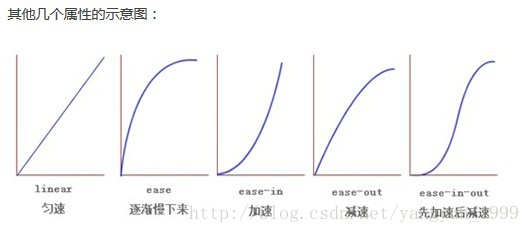

# css动画效果

### 过渡

过渡( transition)是CSS3中具有颠覆性的特征之一, 我们可以在不使用Flash 动画或 JavaScript的情况下,当元素从一种样式变换为另一种样式时为元素添加效果，可以让我们页面更好看,更动感十足

**transition**: 要过渡的属性  花费时间  运动曲线  何时开始; 

1.属性 ： 想要变化的 css 属性， 宽度高度 背景颜色 内外边距都可以 。如果想要所有的属性都 变化过渡， 写一个all 就可以。

2.花费时间： 单位是 秒（必须写单位） 比如 0.5s 

3.运动曲线： 默认是 ease （可以省略）

4.何时开始 ：单位是 秒（必须写单位）可以设置延迟触发时间  默认是 0s  （可以省略）

**运动曲线示意图**



记住过渡的使用口诀： 谁做过渡给谁加 

```css
div {
  width: 200px;
  height: 100px;
  background: red;
  /*transition: width .5s ease, height .5s linear;*/
  transition: all .5s;
}
div:hover {
  width: 500px;
  height: 200px;
}
```

### 2D 转换

转换（transform）可以实现元素的位移、旋转、缩放等效果

移动：translate
旋转：rotate
缩放：scale

#### 2D 转换之移动 translate

2D移动是2D转换里面的一种功能，可以改变元素在页面中的位置

语法

transform: translate(x,y); 或者分开写
transform: translateX(n);
transform: translateY(n);

定义 2D 转换中的移动，沿着 X 和 Y 轴移动元素
translate中的百分比单位是相对于自身元素的宽度和高度 translate:(50%,50%);

```css
div {
  width: 200px;
  height: 100px;
  background: red;
  transition: all .5s;
}
div:hover {
  transform: translate(50px, 50px);
}
```

#### 2D 转换之旋转 rotate

2D旋转指的是让元素在2维平面内顺时针旋转或者逆时针旋转

语法
transform:rotate(度数)

rotate里面跟度数， 单位是 deg  比如  rotate(45deg)
角度为正时，顺时针，负时，为逆时针
默认旋转的中心点是元素的中心点

2D 转换中心点 transform-origin
语法
transform-origin: x y;

注意后面的参数 x 和 y 用空格隔开
x y 默认转换的中心点是元素的中心点 (50%  50%)
还可以给x y 设置 像素 或者  方位名词  （top  bottom  left  right  center）

```css
div {
  width: 200px;
  height: 100px;
  background: red;
  transition: all .5s;
}
div:hover {
  transform: rotate(180deg);
  transform-origin: right bottom;
}
```

#### 2D 转换之缩放scale

缩放，顾名思义，可以放大和缩小。 只要给元素添加上了这个属性就能控制它放大还是缩小

语法
transform:scale(x,y);
注意其中的x和y用逗号分隔
不带单位表示放大的倍数

transform:scale(1,1) ：宽和高都放大一倍，相对于没有放大
transform:scale(2,2) ：宽和高都放大了2倍
transform:scale(2) ：只写一个参数，第二个参数则和第一个参数一样，相当于 scale(2,2)
transform:scale(0.5,0.5)：缩小

```css
div {
  width: 200px;
  height: 100px;
  background: red;
  transition: all .5s;
}
div:hover {
  transform: scale(2, 2);
}
```

#### 2D 转换综合写法

   1.同时使用多个转换，其格式为：transform: translate() rotate() scale() ...等，中间用空格隔开

2. 其顺序会影转换的效果。（先旋转会改变坐标轴方向）
3. 当我们同时有位移和其他属性的时候，记得要将位移放到最前

```css
div {
  width: 200px;
  height: 100px;
  background: red;
  transition: all .5s;
}
div:hover {
  transform:translateX(500px) rotate(180deg) scale(2, 2);
}
```

#### 动画（animation)

**动画（animation）**是CSS3中具有颠覆性的特征之一, 可通过设置多个节点来精确控制一个或一组动画，常用来实现复杂的动画效果。
相比较过渡，动画可以实现更多变化，更多控制，连续自动播放等效果

#### 动画的基本使用

制作动画分为两步：
  1.先定义动画
  2.再使用（调用）动画

**用keyframes 定义动画**

```css
@keyframes 动画名称 {
   0%{
        width:100px;
   }  
   100%{
        width:200px;
   }
}
```

**元素使用动画**

```css
div {
  width: 200px;
  height: 200px;
  background: red;
  animation: move 2s;
}
```

**动画序列**

- 0% 是动画的开始，100% 是动画的完成。这样的规则就是动画序列。
- 在 @keyframes 中规定某项 CSS 样式，就能创建由当前样式逐渐改为新样式的
  动画效果。
- 动画是使元素从一种样式逐渐变化为另一种样式的效果。您可以改变任意多的样
  式任意多的次数。
- 请用百分比来规定变化发生的时间，或用关键词 "from" 和 "to"，等同于 0%
   和 100%。

```css
div {
  width: 200px;
  height: 200px;
  background: red;
  animation: move 10s;
}
@keyframes move {
  0% {
    transform: translate(0px, 0px);
  }
  25% {
    transform: translate(1000px, 0px);
  }
  50% {
    transform: translate(1000px, 500px);
  }
  75% {
    transform: translate(0, 500px);
  }
  100% {
    transform: translate(0px, 0px);
  }
}
```

**动画属性**

| 属性                      | 描述                                                         |
| ------------------------- | ------------------------------------------------------------ |
| @keyframe                 | 规定动画                                                     |
| animation                 | 所有动画属性的简写属性，除了animation-play-state属性         |
| animation-name            | 规定@keyframes动画的名称。（必须的）                         |
| animation-duration        | 规定动画完成一个周期所花费的秒或毫秒，默认是0。（必须的）    |
| animation-timing-function | 规定动画的速度曲线，默认是“ease”                             |
| animation-delay           | 规定动画何时开始，默认是0                                    |
| animation-iteration-count | 规定动画被播放的次数，默认是1，还有infinite                  |
| animation-direction       | 规定动画是否在下一周期逆向播放，默认是“normal“,alternate逆播放 |
| animation-play-state      | 规定动画是否正在运行或暂停。默认是"running",还有"paused"     |
| animation-fill-mode       | 规定动画结束后状态，保持forwards，回到起始backwards          |

**动画简写属性**
animation：动画名称 持续时间 运动曲线 何时开始 播放次数 是否反方向 动画起始或者结束的状态

```css
animation: move 1s linear 2s infinite alternate;
```

- 简写属性里面不包含 animation-play-state 
- 暂停动画：animation-play-state:   puased;   经常和鼠标经过等其他配合使用
- 想要动画走回来 ，而不是直接跳回来：animation-direction  ：  alternate
- 盒子动画结束后，停在结束位置：  animation-fill-mode  ：   forwards 


